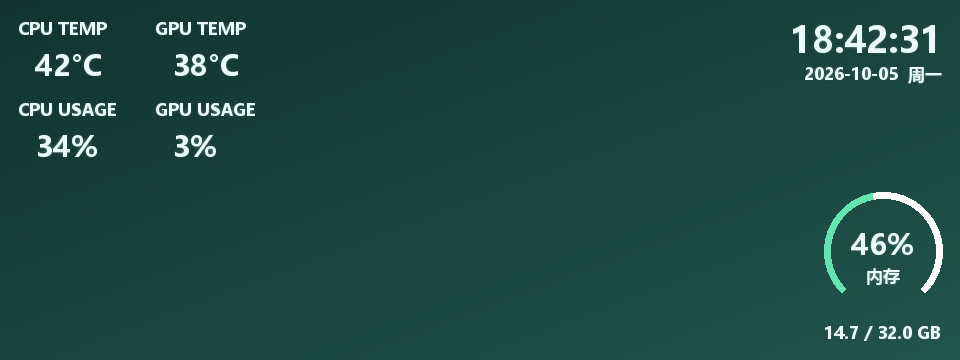
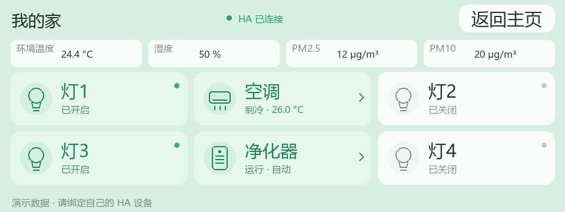
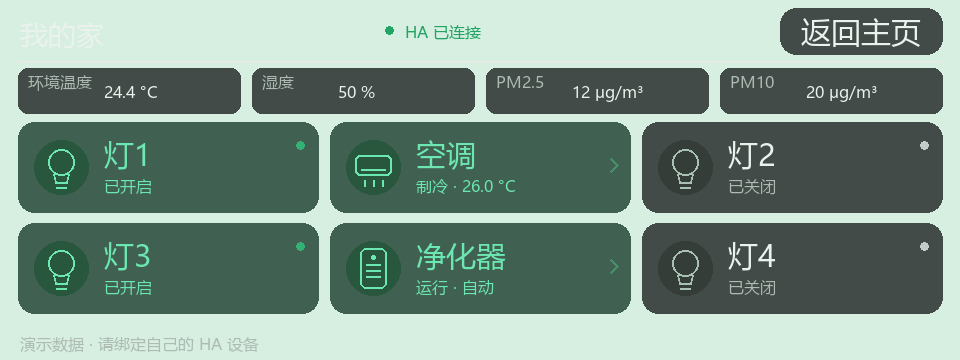
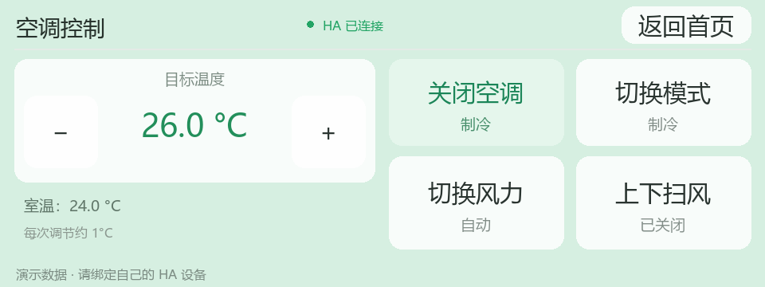
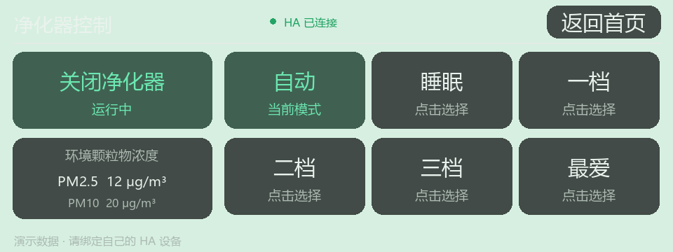

# VK03 Home Panel

**简体中文** · [English](README.en.md)

把 VK03 USB 触摸屏变成 Windows PC 监控屏和 Home Assistant 家居控制面板。

**v1.0.1** · Windows · 960 × 360 · MIT（第三方组件各自遵守其许可证）

[下载正式版](https://github.com/bondwang666-k9999w11/vk03-home-panel/releases/latest) · [安装教程](docs/QUICKSTART.md) · [设备匹配](docs/DEVICE-MAPPING.md) · [反馈问题](https://github.com/bondwang666-k9999w11/vk03-home-panel/issues)



默认播放自定义图片、GIF 或视频，叠加 CPU/GPU 温度和占用率、内存仪表、时间日期。触摸任意位置进入家居控制，首次触摸只唤醒页面；30 秒没有触摸后自动返回监控页。家居首页也可以点击右上角“返回主页”。

## 功能

- 控制中心直接打开设置，关闭后留在系统托盘；可以设置登录自启动。
- 图片/GIF/视频背景、5–30 FPS、字体颜色、无描边粗体发光监控文字。
- 米家风格的浅色/深色按钮，共用透明度滑条。
- CPU/GPU/内存采集与网络访问分开运行，媒体使用有界缓存，静态页面保活。
- **HA 设备匹配向导**：读取自己的 HA 实体，选择最多 4 个灯具、1 个空调、1 个净化器和温湿度/PM2.5/PM10 传感器。
- 灯具支持 `switch` 和 `light`；空调读取可用模式、风档和扫风；净化器读取预设模式，无预设时可使用设备提供的百分比风速控制。
- 无绑定的设备停用，没有能力的操作不显示。首次读取/离线时不使用假状态。
- HA 断线自动重连；控制请求不自动重试，避免重复触发设备。
- Token 使用 Windows DPAPI 按当前用户加密，只保存在本机。

## 界面展示

以下图片由程序实际绘图代码生成，设备状态、硬件指标和时间均为演示值。背景为原创纯色/渐变，用户可以自行更换为图片、GIF 或视频。

### 智能家居控制

浅色和深色按钮共用透明度设置：





### 空调与空气净化器

具体按钮随 HA 实体提供的能力变化，未绑定的设备停用。





### 日常使用

监控主页 → 触摸任意位置 → 家居控制 → 无触摸 30 秒或点击返回按钮 → 监控主页。关闭设置窗口后程序保留在系统托盘。

## 开始使用

第一次使用？请先阅读 [新手入门：从下载到第一次触屏控制](docs/QUICKSTART.md)，并从 [Releases](https://github.com/bondwang666-k9999w11/vk03-home-panel/releases/latest) 下载 core 安装包。

1. 按 [安装指南](docs/INSTALL.md) 准备 Python、依赖和已验证的 VK03 USB 驱动。
2. 把程序放在 **`C:\VK03`**。首次运行 `StartVK03.cmd`（源码版）或 `VK03控制中心.exe`（Release 版）。
3. 在自动打开的设备匹配向导中填入自己的 HA 地址与长期访问 Token，点击“连接并读取设备”。
4. 为各位置选择自己的实体，未用的位置留空；可修改按钮名称。点击“保存并应用设备匹配”。
5. 在外观设置中选择背景和浅色/深色，点击“保存并应用”。

米家账号、米家设备接入由用户在 Home Assistant 中完成，**面板不登录米家账号，不要求提供米家账号密码**。其他品牌接入 HA 后，符合上述实体类型也可以绑定；不承诺所有设备型号都兼容。

## 文档

- [新手入门完整流程](docs/QUICKSTART.md)

- [安装、自启动、USB 和排错](docs/INSTALL.md)
- [USB 驱动检查、接口识别与排错](docs/USB-DRIVERS.md)
- [米家设备接入与实体匹配教程](docs/DEVICE-MAPPING.md)
- [CPU 温度组件准备与安装](docs/CPU-SENSORS.md)
- [配置格式和安全范围](docs/CONFIGURATION.md)
- [源码构建与 Release 打包](docs/BUILD.md)
- [发布到 GitHub](docs/PUBLISH.md)
- [更新记录](CHANGELOG.md)

## 支持范围与限制

硬件通讯沿用已实测的 VK03 驱动与协议：显示 VID/PID `345F:9132`，触摸 `374A:A401`，Bulk interface 3 / endpoint `0x04`，HID 控制与触摸接口保留。不同硬件版本未验证；程序不会自动替换驱动。

现有正式版已经在 Windows 11、NVIDIA RTX 5070 Ti 上实测。GPU 温度/占用当前仅支持 `nvidia-smi`，AMD/Intel GPU 显示 `--`。CPU 温度为选装 LibreHardwareMonitor + PawnIO，硬件不支持或采集过期时显示 `--`。内存为物理 RAM 使用量。

视频/大 GIF 需要自行准备 `ffmpeg.exe`；普通图片与小 GIF 不依赖 FFmpeg。实际 FPS 受 USB 传输和主机性能影响，30 FPS 是目标值。空调目前支持单目标温度，不提供双温度区间设置；净化器页面最多显示前 6 个预设。GUI 家居预览使用模拟设备，监控预览读取本机面板发布的实时数据。

本次开源版增加的设备向导、通用配置和设备能力分支已做模拟回归，仍需在使用者自己的 HA/设备上验证。屏幕停止后可能保留最后一帧，按键不再响应即可判断已经停止。

这是独立社区项目，与 VK03 厂商、米家和 Home Assistant 官方无隶属关系。请勿提交个人 Token、设备配置、日志或有版权限制的背景素材。

## 开发验证

```powershell
py -3 -m pip install -r requirements.txt
py -3 -m unittest discover -s tests -v
py -3 tools/check_public_tree.py
```

测试不会访问实体设备、安装驱动或向 HA 发送控制命令。`LICENSE` 适用于本项目自有代码，第三方工具与库见 [THIRD_PARTY_NOTICES.md](THIRD_PARTY_NOTICES.md)。
